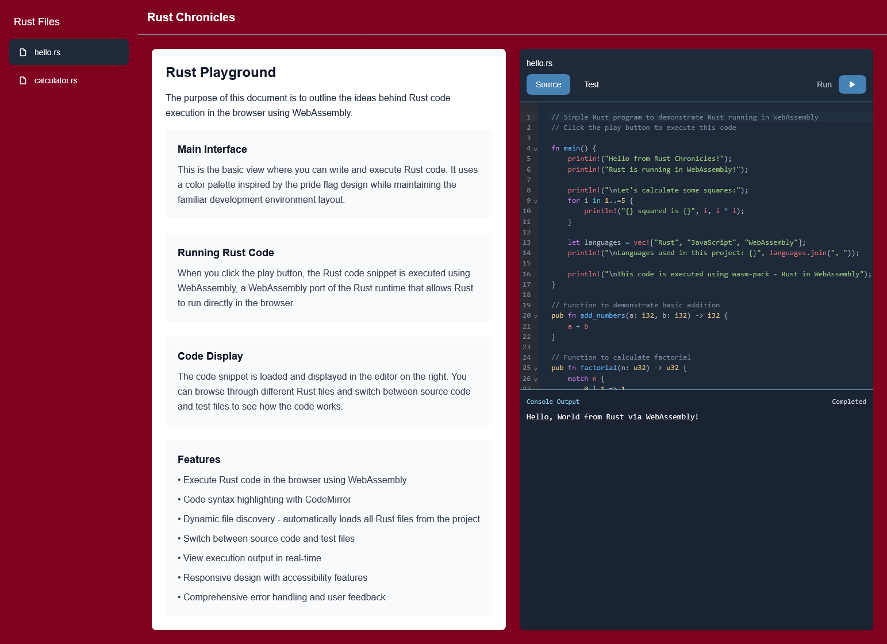

# Rusty Ventures

A Next.js project that demonstrates integration with Rust via WebAssembly. This project allows you to view and execute Rust code in the browser.

## Preview



## Features

- Split-screen layout with documentation on the left and code on the right
- Rust code execution in the browser using WebAssembly
- Modern UI with responsive design

## Getting Started

First, build the WebAssembly module:

```bash
# Install wasm-pack if you haven't already
npm install -g wasm-pack

# Build the Rust WebAssembly module
npm run build-wasm
```

Then, run the development server:

```bash
npm run dev
```

Open [http://localhost:3000](http://localhost:3000) with your browser to see the application.

## Available Scripts

- `npm run dev` - Start the development server
- `npm run build` - Build the application for production
- `npm run build-wasm` - Compile Rust code to WebAssembly
- `npm run build-no-wasm` - Build Next.js app without recompiling WASM (uses existing artifacts)
- `npm start` - Start the production server
- `npm run lint` - Run ESLint for code quality checks

## Technology Stack

- **Frontend**: Next.js with TypeScript and CSS Modules
- **Rust**: WebAssembly compilation using wasm-pack
- **Integration**: Dynamic imports for WebAssembly modules

## Project Structure

- `/rust`: Contains the Rust code that gets compiled to WebAssembly
- `/src/components`: React components for the UI
- `/public/wasm`: Output directory for compiled WebAssembly modules

## CI/CD and Deployment

This project uses GitHub Actions for automated building and deployment to Netlify.

### GitHub Actions Workflow

[](https://github.com/achudars/rusty-ventures/actions/workflows/deploy.yml)

The workflow (`deploy.yml`) automatically:

1. **Sets up the environment**:

   - Installs Node.js 18
   - Sets up Rust toolchain (stable)
   - Installs wasm-pack for WebAssembly compilation

2. **Builds the application**:

   - Installs npm dependencies
   - Compiles Rust code to WebAssembly using `npm run build-wasm`
   - Builds the Next.js application with `npm run build-no-wasm`

3. **Deploys to Netlify**:
   - Automatically deploys to Netlify on pushes to main/master branch
   - Creates preview deployments for pull requests
   - Uses Netlify's deployment API for seamless integration

**Triggers**: The workflow runs on:

- Push to `main` or `master` branches
- Pull requests targeting `main` or `master` branches

**Dependencies**: The workflow requires the following secrets to be configured:

- `NETLIFY_AUTH_TOKEN`: Netlify API authentication token
- `NETLIFY_SITE_ID`: Netlify site identifier for deployment target

### Deployment Strategy

The project uses a specialized build approach for deployment:

- **Development**: Uses `npm run build-wasm` + `npm run dev` for local development with full Rust compilation
- **Production**: Uses `npm run build-no-wasm` for deployment, utilizing pre-built WASM files to avoid Rust compilation on Netlify

This approach ensures:

- ✅ Fast deployment times (no Rust compilation required)
- ✅ Reliable builds (pre-compiled WASM artifacts)
- ✅ Consistent environments across development and production
